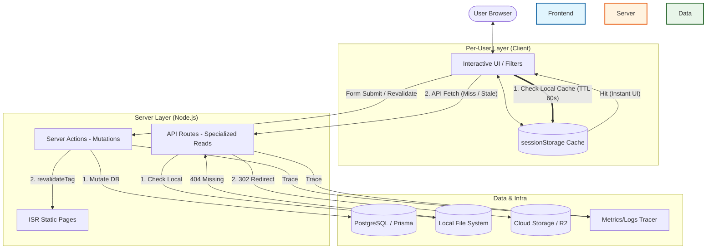

# Karkey Technical Architecture

This document describes the architectural patterns, data flow, and division of labor within the Karkey platform.

## 1. System Overview & Data Flow


> [!IMPORTANT]
> **Performance & Web Vitals**: The combination of **Client-Side Prefetch** and **Skeleton UIs** ensures that the application maintains a very low **LCP (Largest Contentful Paint)** and high **Layout Stability (CLS)**. Prefetch + Skeleton UI ensures **near-instant visual feedback** and minimal layout shift, improving **Core Web Vitals**.

## 2. Component Division of Labor

### 2.1 Server API Routes (`/app/api`)
Used for specialized read operations and external integrations:
- **Search API**: Handles complex filtering with specialized logic.
- **Asset Proxy**: Manages intelligent delivery (AVIF/WebP). If a local file is missing, it issues a **302 Redirect** to the cloud fallback URL.
- **API Versioning Best Practice**:
  - `GET /api/v1/search` (Legacy/Mobile support)
  - `GET /api/v2/search` (Future: breaking metadata changes)

### 2.2 Server Actions (`/app/actions/`)
The primary layer for all **data mutations**:
- **Integrity**: Every mutation must call `revalidateTag` to trigger on-demand ISR.
- **Security Check**: Actions verify authentication and authorization before proceeding.

### 2.3 Client Components (`use client`)
Manages UI state and UX optimizations:
- **Smart Prefetch**: Uses versioned `sessionStorage` (TTL 60s) to eliminate network trips.
- **Skeleton UI**: Real-time feedback using dimension-accurate skeletons.

## 3. Safety & Scalability

### 3.1 Rate Limiting & Multi-Node Safety
| Limiter Type | Scope | Pros | Cons |
| :--- | :--- | :--- | :--- |
| **In-Memory** | Single Node | Simple, ultra-fast | Not shared; resets on restart. |
| **Redis** | Multi-Node | Shared, consistent across cluster | Requires external Redis instance. |
| **Cloudflare** | Edge | Blocks bad traffic before origin | External dependency / DNS locked. |

> [!NOTE]
> **Cluster Scaling**: On multi-node setups, a **Redis pub/sub channel** will broadcast `revalidateTag` events to all nodes ensuring global ISR consistency.

> [!NOTE]
> Even protected mutation endpoints respect rate limiting to prevent automated abuse (e.g., bot-driven mass deletions).

### 3.2 Error Handling & Monitoring
- **Monitoring Strategy (Future)**:
    - **Sentry**: For real-time error tracking and performance profiling.
    - **Logflare / BetterStack**: For instant alerts on high-frequency **DB timeouts (> 300ms)** or **asset delivery failures (> 5% rate)**.
    - **Metrics Backbone**: The `Met` tracer can be extended to integrate with **Sentry** or **Logflare** for centralized observability.

**Resiliency Patterns (Retry & Trace)**:
```typescript
const start = performance.now();
// Retry pattern for transient DB errors
for (let i = 0; i < 3; i++) {
    try {
        const data = await prisma.vehicle.findMany({ ... });
        const duration = performance.now() - start;
        if (duration > 300) logWarning('SlowQuery', { duration, reqId });
        return data;
    } catch(err) {
        if(i === 2) {
             logError(err, { reqId }); // Escalate after 3 retries
             return { success: false, error: "ERR_DB_TIMEOUT" };
        }
    }
}
```

## 4. Security Highlights
- **Asset Protection**: Strictly validates paths in `/api/uploads` to prevent directory traversal.
- **Input Sanitization**: All incoming data is validated before being processed by Prisma.
- **Mutation Guards**: Sensitive actions (e.g., deleting a listing) perform backend ownership verification.

---
*Last Updated: December 2025*
